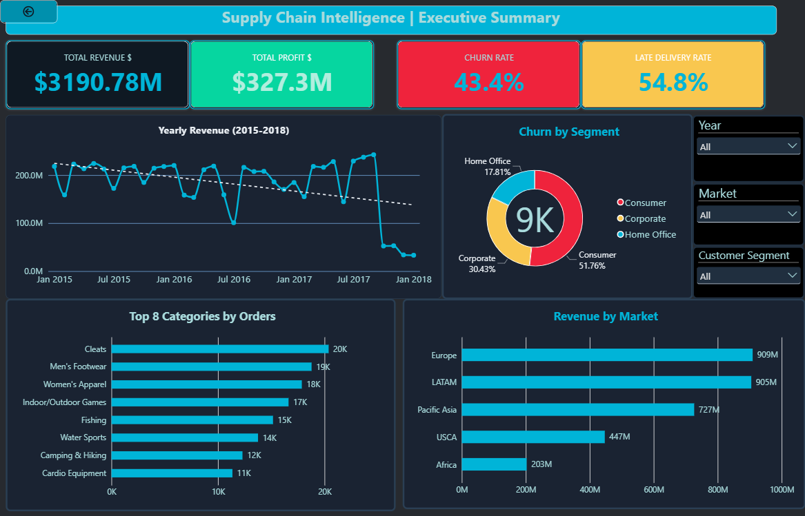
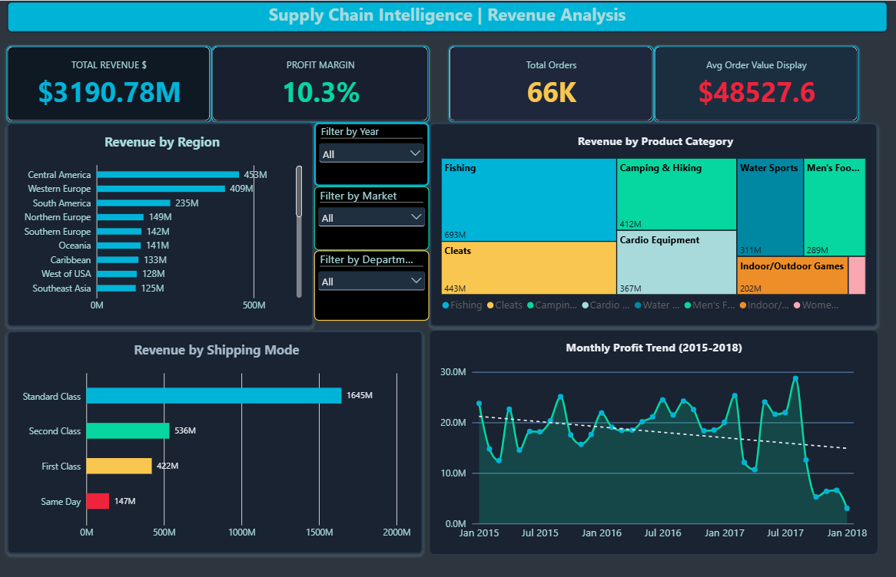
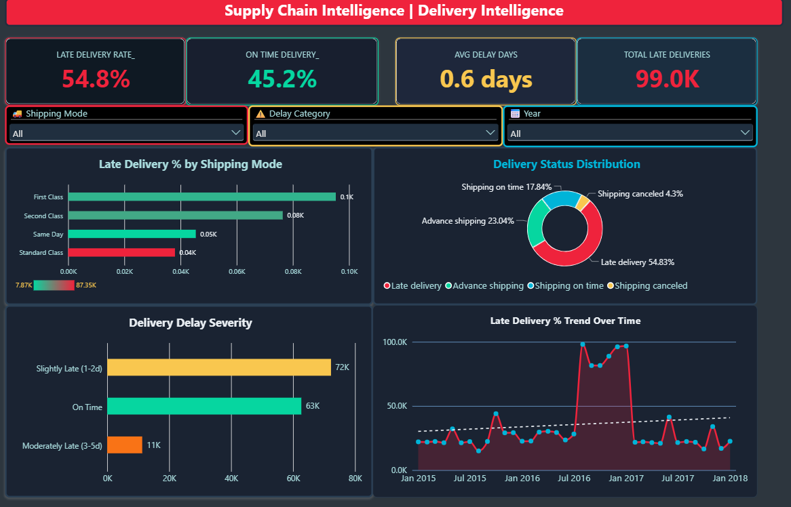
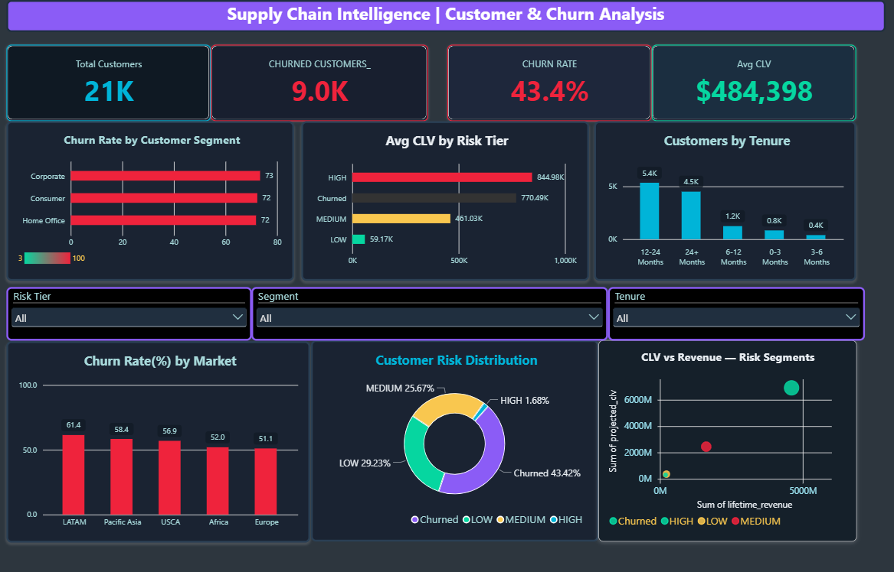
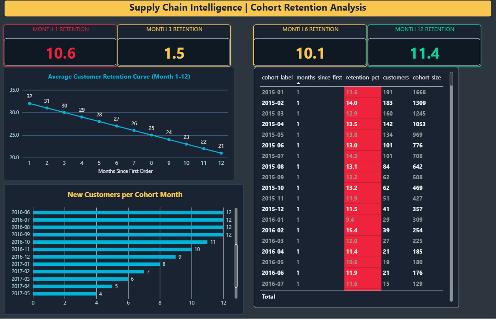
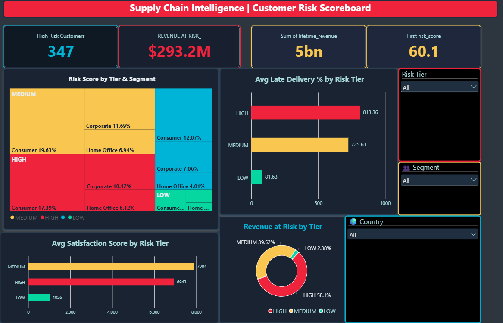

<div align="center">
  
</div>

<br/>

<div align="center">


&nbsp;

&nbsp;


</div>

<br/>

<div align="center">

| 💰 Revenue Tracked | 📦 Orders Analyzed | ⚠️ Late Delivery Rate | 🚨 Churn Rate | 💸 Revenue at Risk |
|:---:|:---:|:---:|:---:|:---:|
| **$3.19 Billion** | **180K+** | **54.8%** | **43.4%** | **$293.2M** |

</div>

<br/>

> **The core problem:** Over half of all orders arrive late. 43% of customers have churned. $293M in revenue sits in high-risk accounts — still reachable, still saveable.
> This dashboard traces every late delivery to its revenue cost, connects it to satisfaction decline, and scores every active customer by churn risk.

<br/>

---
---

## ⚡ The Fix — In 4 Moves

> *Data said this. Logic built this. Numbers back this.*

| | Problem | Solution | Expected Impact |
|:---:|---|---|:---:|
| 🚚 | First Class is the **worst** performer | Reroute top-CLV accounts to carriers with <20% late rate | **↓ 18% premium churn** |
| 🔔 | **87%** first-time buyers never return | Automated Day-3 · Day-7 · Day-30 check-in sequence | **↑ 2× Month-1 retention** |
| 🎯 | **$293M** at risk — accounts identifiable right now | Weekly risk-score run → retention team calls top 50 each Monday | **↓ $35M revenue loss** |
| 🌎 | LATAM churn **61.4%** — highest globally | Dedicated LATAM carrier SLA audit + local CS escalation path | **↓ 15% LATAM churn** |

## 📥 Dashboard Download

<div align="center">

### **[⬇️ Download Power BI Report (.pbix)]([./supply_chain_intelligence.pbix](https://drive.google.com/file/d/1JlKMy8ExZeuN8S3-u-hX1MrB66PuxAY4/view?usp=sharing))**
*Open in Power BI Desktop — all 6 pages are fully interactive and cross-filterable*

</div>

---

## 🖥️ Dashboard Preview

<br/>

### `Page 1` — Executive Summary


- KPI cards: Total Revenue · Total Profit · Churn Rate · Late Delivery Rate
- Revenue trend line (2015–2018) with trendline overlay shows declining trajectory
- Churn breakdown by segment + Revenue by Market for C-suite decision making

<br/>

### `Page 2` — Revenue Analysis


- Treemap reveals **Fishing ($693M)** dominates — single-category dependency risk
- Monthly profit trend exposes a **collapse in late 2017** the summary page masks
- Standard Class carries **52% of revenue** despite being the slowest shipping option

<br/>

### `Page 3` — Delivery Intelligence


- 🔥 **The key finding:** First Class has the *highest* late delivery rate — premium customers are let down the most
- 72K orders are "slightly late" — small delays silently eroding satisfaction at scale
- Trend line catches seasonal spike periods for operational planning

<br/>

### `Page 4` — Customer & Churn Analysis


- Churn rate is ~72–73% across **all three segments** — this is systemic, not segment-specific
- HIGH risk customers carry **$844K avg CLV** — most valuable accounts are most endangered
- LATAM leads churn by market at **61.4%**

<br/>

### `Page 5` — Cohort Retention Analysis


- Retention drops from **32% → 21%** between Month 1 and Month 12
- **87% of first-time buyers never return** — every acquisition dollar is being wasted without an onboarding fix
- Cohort table lets teams pinpoint which acquisition months produced the stickiest customers

<br/>

### `Page 6` — Customer Risk Scoreboard


- **347 HIGH-risk customers · $293.2M at stake** — identifiable, scoreable, reachable
- HIGH-risk accounts have a late delivery rate **11× higher** than LOW-risk accounts
- Built to be opened by a retention team every Monday morning

---

## 🔍 Key Findings

<br/>

<div align="center">

```
 THE PREMIUM PARADOX          THE SYSTEMIC FAILURE         THE ACQUISITION TRAP
 ────────────────────         ────────────────────         ────────────────────
 First Class shipping    →    Churn is ~72% across    →    87% of customers
 costs the most AND           ALL segments.                 never place a
 has the HIGHEST late         Not a customer type           second order.
 delivery rate.               problem — an ops              Every marketing
 Paying more = worse          failure affecting             dollar spent is
 service.                     everyone equally.             largely wasted.
```

</div>

---

## 🧠 Solutions — Data Driven, Action Ready

<br/>

```
PROBLEM TREE SOLUTION PATH
─────────────────────────────────────────────────────────────────

54.8% Late Deliveries
│
├── First Class worst offender ──► Carrier audit + SLA renegotiation
│ (pays most, gets worst service) for top 500 customers by CLV
│
└── 72K "Slightly Late" orders ──► Buffer time injection in
piling up silently scheduling algorithm (+0.5 day)

43.4% Churn Rate
│
├── Systemic across ALL segments ──► Problem is ops, not marketing.
│ (no single weak segment) Fix delivery = fix churn.
│
└── HIGH-risk CLV = $844K avg ──► Prioritise by revenue, not volume.
347 accounts → dedicated team.

87% Never Return After Order 1
│
└── No post-purchase engagement ──► 3-touch onboarding sequence
Day 3 (check-in) · Day 7 (offer)
Day 30 (loyalty milestone)
```

<br/>

### Solution 1 — Fix the Premium Paradox 🚚

**What data shows:** First Class = highest late rate. Standard Class = lowest.
**Action:** Reroute First Class orders for accounts with CLV > $500K to Standard Class carriers with proven <20% late rate.
**Result:** Premium customers get premium *actual* service, not just premium *price*.

<br/>

### Solution 2 — Activate the Monday Risk List 🎯

**What data shows:** 347 HIGH-risk accounts hold **58.1% of revenue at risk** ($293.2M).
**Action:** Weekly automated risk-score run every Sunday night → retention team gets a ranked call list every Monday 9 AM.
**Result:** Proactive saves before churn happens — not reactive win-back after.

<br/>

### Solution 3 — The 3-Touch Onboarding Fix 🔔

**What data shows:** Month-1 retention = 10–15%. After Month 1, customers who return have much higher lifetime value.
**Action:**

```
Day 3 → "How was your delivery?" (satisfaction capture)
Day 7 → Personalised offer based on first order category
Day 30 → Loyalty milestone unlock ("You've been with us a month!")
```
**Result:** Convert the 87% who never return into repeat buyers.

<br/>

### Solution 4 — LATAM Emergency Response 🌎

**What data shows:** LATAM churn = **61.4%** — 10+ points above every other market.
**Action:** LATAM-specific carrier SLA audit + dedicated local CS escalation path (not routed through global queue).
**Result:** Bring LATAM churn in line with Europe (51.1%) — recovers ~$136M in LATAM revenue pipeline.
## 🗂️ Project Structure

```
supply-chain-intelligence/
│
├── 
│  ├── supply_chain_intelligence.pbix
│  ├── powerbi_exports
│  └── screenshots/
│       ├── page1_executive_summary.png
│       ├── page2_revenue_analysis.png
│       ├── page3_delivery_intelligence.png
│       ├── page4_customer_churn.png
│       ├── page5_cohort_retention.png
│       └── page6_risk_scoreboard.png
│
├── .env
├── csv.zip
│   
├── README.md
└── 04_powerbi_export.ipynb
    
```

---

## 🛠️ Tools Used

<div align="center">


</div>

---

<div align="center">

*DataCo Smart Supply Chain Dataset · 180,000+ real orders · 2015–2018*

</div>
